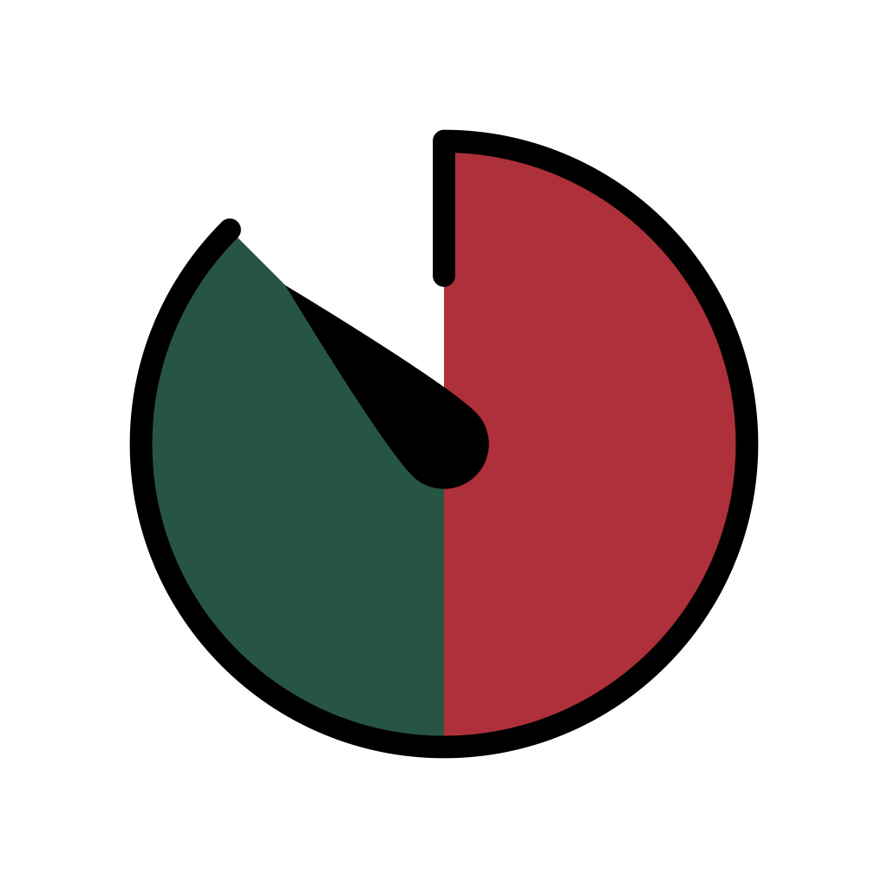

# Time of Possession

Keep track of time of possession for your favorite sports teams during games.

--- 

This app was originally developed by me and put in the App Store in January of 2016. Was a quick app I developed because the lacrosse coach I was collecting stats for kept asking me what our team's time of possession was and I had no idea. Was all built in Objective-C using storyboards. Tens of people used it over the almost 4 years it was available in the App Store! 

When I started to learn Swift and SwiftUI, I decided to completely re-write the app as one of my first little swift projects. It was fun and it's a useful app. 

**Version:** 2.0.0

**Language:** Swift

**Layout:** SwiftUI

**Known issues:** None

**Planned features:**
* Would certainly like a better looking UI. 
